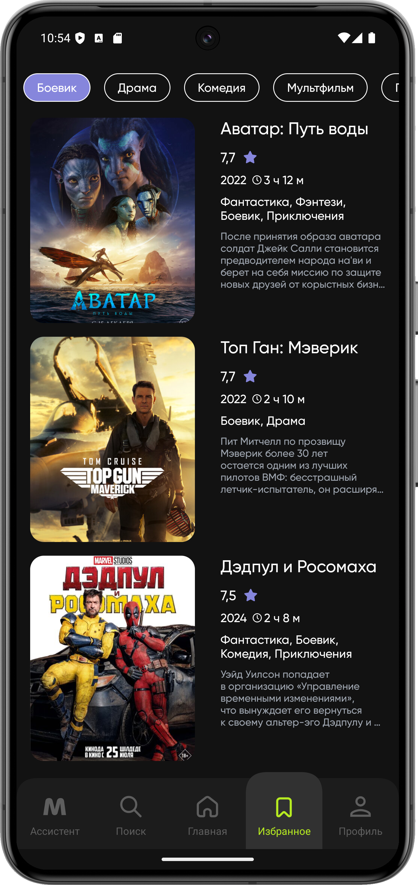

## This project is under development

# Moovich

<b>Moovich is your faithful assistant in the world of cinema. </b>

Looking for a new movie to watch? No problem! Just enter the name or use the convenient search by genre, country and category. The app will instantly offer you suitable options. Bookmark movies to always have a list of your favorite movies at hand. You will never lose a picture you like and will be able to quickly find it at any time. Download our app right now and enjoy watching your favorite movies at your convenience!

[Download](https://minhaskamal.github.io/DownGit/#/home?url=https://github.com/YuryShchasny/Moovich/blob/master/Moovich.apk)

## Screenshots

